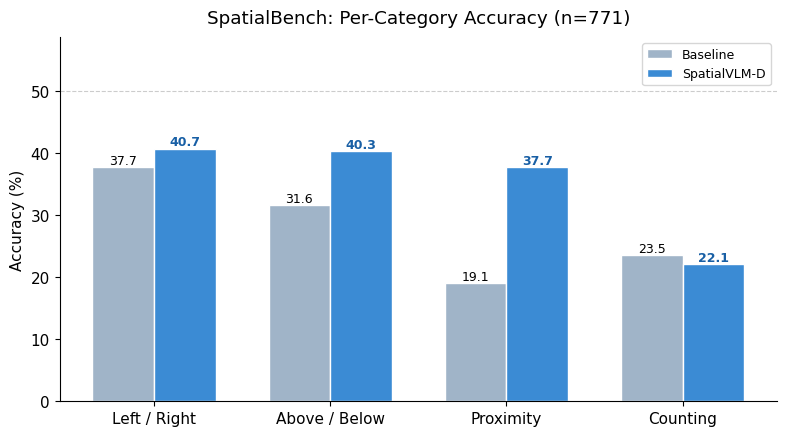
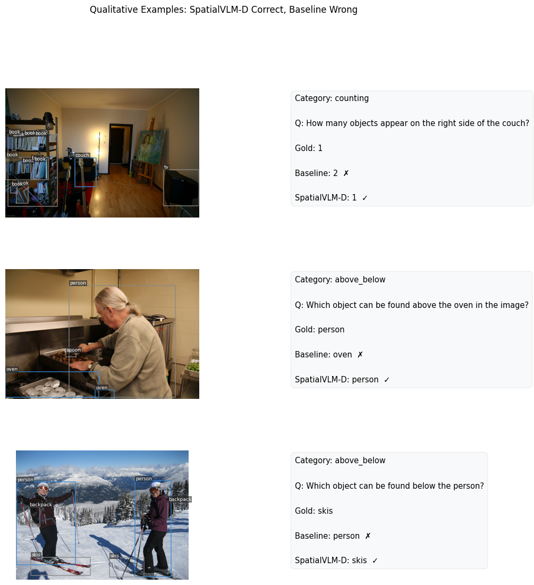

# SpatialBench

**A Diagnostic Benchmark and Detector-Guided Prompting Framework for Fine-Grained Spatial Reasoning in Vision-Language Models**

---

## Key Finding

Current VLMs struggle with fine-grained spatial reasoning. On my **SpatialBench** benchmark (771 QA pairs across 4 spatial categories), LLaVA-1.6-7B achieves only **27.5% overall accuracy** — far below the ~90%+ human baseline.

My proposed **SpatialVLM-D** framework injects structured spatial context from off-the-shelf detectors (Grounding DINO, SAM2) into the VLM prompt at inference time — **no training required**. This yields a **+7.4 percentage point overall improvement**, with gains up to **+18.6pp on proximity reasoning**.

<p align="center">
  
</p>

### Results Summary

| Category | Baseline (LLaVA-1.6-7B) | SpatialVLM-D | Delta |
|---|---|---|---|
| Proximity | 19.1% | **37.7%** | **+18.6pp** |
| Above / Below | 31.6% | **40.3%** | **+8.7pp** |
| Left / Right | 37.7% | **40.7%** | **+3.0pp** |
| Counting | 23.5% | 22.1% | −1.5pp |
| **Overall** | **27.5%** | **34.9%** | **+7.4pp** |

The category-dependent pattern is itself a finding: spatial context helps most when the VLM must reason about *distance* (proximity) and *vertical position* (above/below), but provides limited signal for counting under spatial constraints — suggesting VLMs struggle to integrate structured text with numerical reasoning.

<p align="center">
  
</p>

---

## Method

**SpatialVLM-D** is a training-free, inference-time framework:

1. **Spatial Extraction** — Run Grounding DINO (or use ground-truth annotations) to detect objects and their bounding boxes.
2. **Relation Engine** — A rule-based module computes pairwise spatial relations (left/right, above/below, proximity) from bounding box geometry.
3. **Context Serialization** — Spatial facts are serialized as natural language and prepended to the VLM question.
4. **VLM Inference** — The frozen VLM receives `image + spatial context + question` and generates the answer.

```
[Spatial Context]
Facts: person is to the left of bicycle. person is above bicycle.
       bicycle is to the left of dog. person is above dog.

Question: What object is closest to the bicycle?
```

No gradient updates, no fine-tuning. The entire pipeline runs on a single T4 GPU.

---

## Benchmark: SpatialBench v1.0

**771 QA pairs** across **300 COCO val2017 images**, covering fmy spatial reasoning categories:

- **Left / Right** (167 pairs) — directional queries relative to a reference object
- **Above / Below** (196 pairs) — vertical positioning queries
- **Proximity** (204 pairs) — nearest/farthest object identification
- **Counting** (204 pairs) — counting objects under spatial constraints

All answers are **programmatically derived** from COCO ground-truth bounding boxes — no human annotation required. Each question has 3 paraphrase variants for robustness testing.

---

## Quick Start

The entire pipeline runs in a single Kaggle notebook with **GPU T4 x2** and **Internet ON**.

### Option 1: Run on Kaggle (recommended)

1. Upload `spatialbench.ipynb` to Kaggle
2. Settings → Accelerator: **GPU T4 x2**, Internet: **ON**
3. Run all cells top to bottom (~3–4 hmys for full benchmark)

### Option 2: Run locally

```bash
# Requirements
pip install pycocotools bitsandbytes accelerate transformers sentencepiece protobuf

# The notebook downloads COCO annotations automatically.
# Models are loaded from HuggingFace Hub.
```

### Output files

After a full run, you get:

```
benchmark/spatialbench_v1.json         # 771 QA pairs with gold answers
results/results_baseline_*.json        # Per-QA predictions (baseline)
results/results_spatial_*.json         # Per-QA predictions (SpatialVLM-D)
results/summary.json                   # Accuracy summary
figures/fig1_accuracy_by_category.png  # Bar chart
figures/fig2_overall_accuracy.png      # Overall comparison
figures/fig3_qualitative.png           # Qualitative examples
```

---

## Roadmap

- [x] Benchmark v1.0 — 4 categories, 771 QA pairs from COCO
- [x] Baseline evaluation — LLaVA-1.6-7B
- [x] SpatialVLM-D (training-free) — GT-context variant
- [x] Patch: improved context serialization and answer extraction
- [ ] Add 2–3 more VLMs (InternVL2-8B, Qwen2-VL-7B, MiniCPM-V)
- [ ] Grounding DINO as spatial extractor (non-oracle evaluation)
- [ ] Expand benchmark to 3,000+ QA pairs (add Visual Genome, SUN RGB-D)
- [ ] Add occlusion and containment categories
- [ ] Multi-hop spatial reasoning queries
- [ ] Ablation: bbox-only vs. +depth vs. +mask context
- [ ] LoRA fine-tuning variant (SpatialVLM-D-FT)
- [ ] arXiv preprint (target: September 2026)

---

## Citation

```bibtex
@misc{tandekar2026spatialbench,
  title   = {SpatialBench: A Diagnostic Benchmark and Detector-Guided Prompting
             Framework for Fine-Grained Spatial Reasoning in Vision-Language Models},
  author  = {Tandekar, Minal},
  year    = {2026},
  note    = {Work in progress. Code: https://github.com/Meyuki-hell/spatialbench-vlm}
}
```

---

## License

MIT License. See [LICENSE](LICENSE) for details.

---

## Acknowledgements

- [LLaVA](https://github.com/haotian-liu/LLaVA) — base VLM
- [Grounding DINO](https://github.com/IDEA-Research/GroundingDINO) — open-vocabulary object detection
- [COCO Dataset](https://cocodataset.org) — images and annotations
